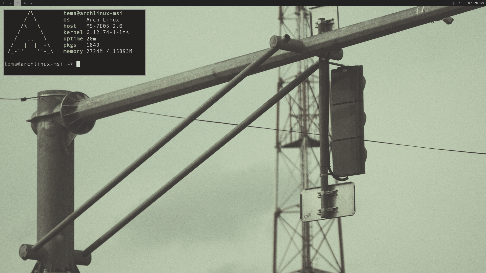
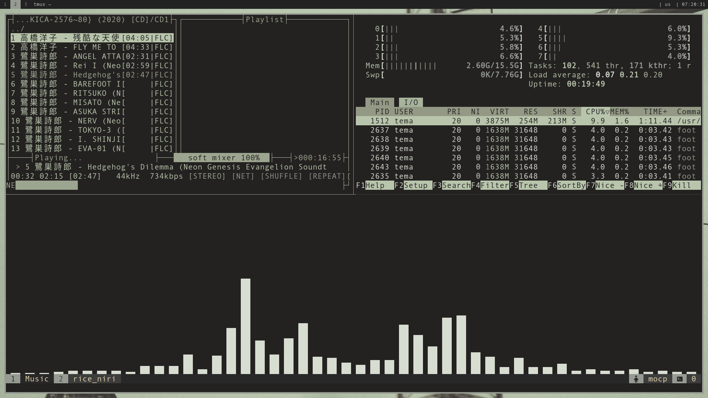
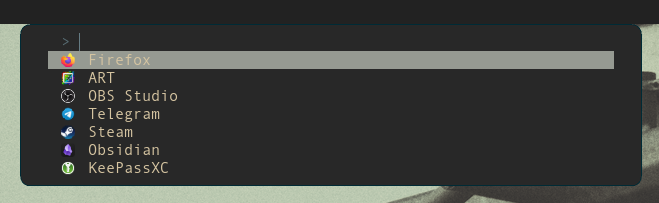
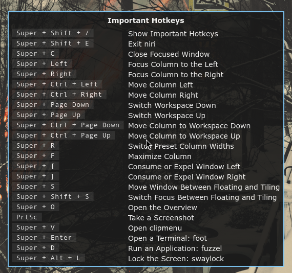

# my rice niri
это мой *rice* для оконного менеджера [niri](https://github.com/YaLTeR/niri).

## скриншоты

## особенности
*   : `gruvbox` + `Pywal`
*   стек: `Jupiter-37A` + `ART` + `Pywal`
*   используемые утилиты: 
    [neovim](https://github.com/neovim/neovim),
    [fuzzel](https://codeberg.org/dnkl/fuzzel),
    [foot](https://codeberg.org/dnkl/foot),
    [cliphist](https://github.com/sentriz/cliphist),
    [swww](https://github.com/LGFae/swww),
    [tmux](https://github.com/tmux/tmux),
    [fish](https://github.com/fish-shell/fish-shell),
    [gammastep](https://gitlab.com/chinstrap/gammastep),
    [cmus](https://github.com/cmus/cmus),
    [swaylock](https://github.com/swaywm/swaylock)

## конфигурация tmux
В этом репозитории лежит мой конфиг **tmux** с [tpm](https://github.com/tmux-plugins/tpm) и [gruvbox](https://github.com/TemaSoul/rice_niri/tree/main/tmux/.tmux/plugins/tmux-gruvbox)

## swaylock
*   зависимости: `swaylock-effects` из AUR

## зависимости
*   базовые инструменты сборки: `base-devel`, `git`
*   дополнительные программы: `swww`, `flameshot`, `gammastep`, `tmux`, `fish`, `cliphist`, `fuzzel`, `foot`, `niri` 

